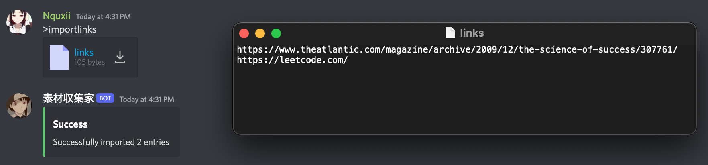

# Resource management Discord bot

This is a Discord bot for our server which is meant for centralized resource aggregation, management, and search. Saving useful and unique resources together as a group for various topics is now significantly easier with this bot. No more keeping track of arbitrary links buried across DMs.

## Features Overview

- Weekly backups of resource database
- On-demand export to CSV or JSON
- Submit links or attachments with keywords and an optional description
  - SEO data pulled for improved search results
- Batch import from a file of links
- Search using author and query filters
  - Custom limit option
  - Paginated 12 records per page using new interactions library
- Immutable records with a constant log of newly added submissions

## Commands

### Add submission
Adds a single submission to the resource database

#### Format
```
[category] [description] [link]
```
in any designated channel, like `#submissions`

#### Example
```
"Programming" "Ask and view programming questions" https://stackoverflow.com/
```


### Import links
Adds a file of links to the resource database

#### Format
`>importlinks`
with an embedded text file.

#### Example




### Search
Sends a search query to the database given a set of certain parameters and returns the result

#### Format
```
>search [string] [user]
```

#### Example


### Export
Export a list of saved resources given a filetype parameter (either json or csv)

#### Format
```
>export 
```

#### Example

